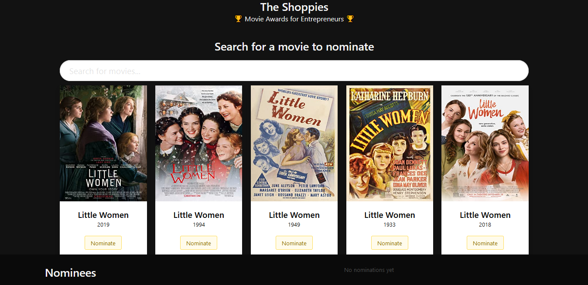
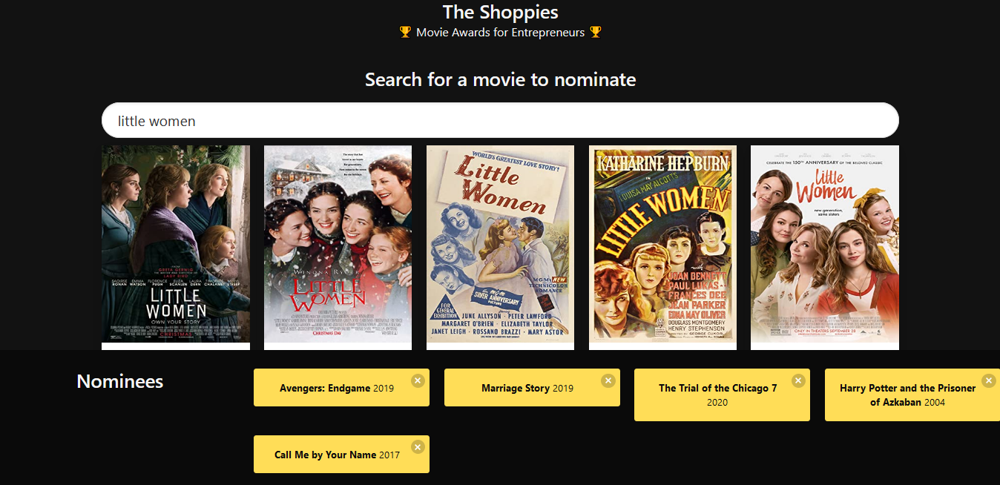
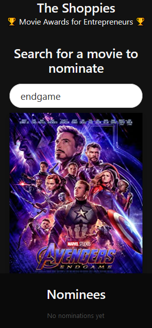
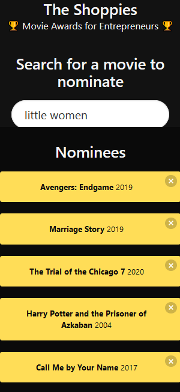

# nominatory

This is a project created as a solution to the Shopify challenge for a front-end developer position. The challenge was to create a webpage that can search OMDB for movies, and allow the user to save their favourite films they feel should be up for nomination. When they've selected 5 nominees they should be notified they're finished. The title of the challenge is 'The Shoppies: Movie Awards for Entrepreneurs'.

The demo for the project can be found here: [The Shoppies](https://eager-yalow-a4d447.netlify.app/)

These were the technical requirements of the application:
* Search results should come from OMDB's API.
* Each search result should list at least its title, year of release and a button to nominate that film.
* Updates to the search terms should update the result list
* Movies in search results can be added and removed from the nomination list.
* If a search result has already been nominated, disable its nominate button.
* Display a banner when the user has 5 nominations.

Aditional features added:
* Ability to store the nominee list in the localStorage of the user so that user can save the list even if the browser is closed or the user leaves the page.
* Added animations for the search results, the page and the banner.
* Added responsiveness to the application ( ensures a mobile friendly layout )

## Built With

Frameworks and libraries used to build this project are:
* React.js
* Animate.css for animations
* Axios for fetching data
* Bulma for styling

## Screenshots 
Here are screenshots of the application: 

### Desktop layout
#### Desktop view without nominations
\

#### Desktop view with nominations

### Mobile Layout
#### Mobie view without nominations
\

#### Mobie view without nominations

